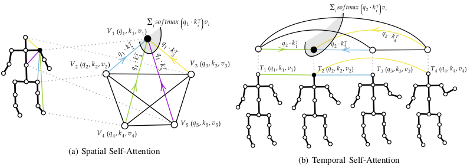
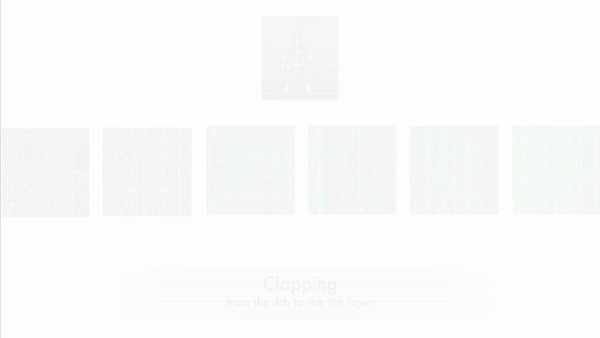

# Spatial Temporal Transformer Network

### Introduction
This repository contains the implementation of the model presented in the following paper:

> **Spatial Temporal Graph Convolutional Networks for Skeleton-Based Action Recognition**, Chiara Plizzari, Marco Cannici, Matteo Matteucci, [ArXiv](https://arxiv.org/abs/2008.07404)

> **Skeleton-based action recognition via spatial and temporal transformer networks**, Chiara Plizzari, Marco Cannici, Matteo Matteucci, Computer Vision and Image Understanding, Volumes 208-209, 2021, 103219, ISSN 1077-3142, [CVIU](https://doi.org/10.1016/j.cviu.2021.103219)

### Visualizations of Spatial Transformer logits

The heatmaps are 25 x 25 matrices, where each row and each column represents a body joint. An element in position (i, j) represents the correlation between joint i and joint j, resulting from self-attention.

### Prerequisites
- Python3
- [PyTorch](http://pytorch.org)
- All the libraries in <code>requirements.txt</code>

### Run mode
<pre><code> python3 main.py </pre></code>

**Training**:
Set in <code>/config/st_gcn/nturgbd/train.yaml</code>:
- <code>Training</code>: True

**Testing**:
Set in <code>/config/st_gcn/nturgbd/train.yaml</code>:
- <code>Training</code>: False

### Data generation
We performed our experiments on three datasets: **NTU-RGB+D 60**, **NTU-RGB+D 120** and **Kinetics**. 
#### NTU-RGB+D
The data can downloaded from [their website](http://rose1.ntu.edu.sg/datasets/actionrecognition.asp). You need to download **3D Skeletons** only (5.8G (NTU-60) + 4.5G (NTU-120)). Once downloaded, use the following to generate joint data for NTU-60:
<pre><code> python3 ntu_gendata.py </pre></code>
If you want to generate data and preprocess them, use directly:
<pre><code> python3 preprocess.py </pre></code>
In order to generate bones, you need to run: 
<pre><code> python3 ntu_gen_bones.py </pre></code>
The joint information and bone information can be merged through:
<pre><code> python3 ntu_merge_joint_bones.py </pre></code>

For NTU-120, the samples are divided between training and testing in a different way. Thus, you need to run: 
<pre><code> python3 ntu120_gendata.py </pre></code>
If you want to generate data and process them directly, use: 
<pre><code> python3 preprocess_120.py </pre></code>

#### Kinetics

[Kinetics](https://deepmind.com/research/open-source/open-source-datasets/kinetics/) is a dataset for video action recognition, consisting of raw video data only. The corresponding skeletons are extracted using Openpose, and are available for download at [GoogleDrive](https://drive.google.com/open?id=1SPQ6FmFsjGg3f59uCWfdUWI-5HJM_YhZ) (7.5G). 
From raw skeletons, generate the dataset by running:
<pre><code> python3 kinetics_gendata.py </pre></code>

### Spatial Transformer Stream
Spatial Transformer implementation corresponds to <code>ST-TR/code/st_gcn/net/spatial_transformer.py</code>.
Set in <code>/config/st_gcn/nturgbd/train.yaml</code>:
- <code>attention: True</code>
- <code>tcn_attention: False</code>
- <code>only_attention: True</code>
- <code>all_layers: False</code>

to run the spatial transformer stream (S-TR-stream).

### Temporal Transformer Stream
Temporal Transformer implementation corresponds to <code>ST-TR/code/st_gcn/net/temporal_transformer.py</code>.
Set in <code>/config/st_gcn/nturgbd/train.yaml </code>:
- <code>attention: False</code>
- <code>tcn_attention: True</code>
- <code>only_attention: True</code>
- <code>all_layers: False</code>

to run the temporal transformer stream (T-TR-stream).

### To merge S-TR and T-TR (ST-TR)
The score resulting from the S-TR stream and T-TR stream are combined to produce the final ST-TR score by: 
<pre><code>  python3 ensemble.py </pre></code>

### Adaptive Configuration (AGCN)

In order to run T-TR-agcn and ST-TR-agcn configurations, please set <code>agcn: True</code>.

### Different ST-TR configurations
Set in <code>/config/st_gcn/nturgbd/train.yaml</code>:
- <code>only_attention: False</code>, to use ST-TR as an augmentation procedure to ST-GCN (refer to Sec. V(E) "Effect of Augmenting Convolution with Self-Attention")
- <code>all_layers: True</code>, to apply ST-TR on all layers, otherwise it will be applied from the 4th layer on (refer to Sec. V(D) "Effect of Applying Self-Attention to Feature Extraction")
- Set both <code>attention: True</code> and <code>tcn_attention: True</code> to combine both SSA and TSA on a unique stream (refer to Sec. V(F) "Effect of combining SSA and TSA on one stream")
- <code>more_channels: True</code>, to assign to each head more channels than dk/Nh.
- <code>n</code>: used if <code>more_channels</code> is set to True, in order to assign to each head dk*num/Nh channels

To set the block dimensions of the windowed version of Temporal Transformer:
- <code>dim_block1, dim_block2, dim_block3</code>, respectively to set block dimension where the output channels are equal to 64, 128 and 256.

### Second order information
Set in <code>/config/st_gcn/nturgbd/train.yaml</code>:
- <code>channels: 6 </code>, because on channels dimension we have both the coordinates of joint (3), and coordinates of bones(3)
- <code>double_channel: True </code>, since in this configuration we also doubled the channels in each layer.

### Pre-trained Models
Please notice I have attached pre-trained models of the configurations presented in the paper in the <code>checkpoint_ST-TR</code> folder. Please note that the \*_bones_\*.pth configurations correspond to the models trained with joint+bones information, while the others are trained with joints only.

### Citation 
Please cite the following paper if you use this code for your researches:

<pre><code> @article{PLIZZARI2021103219,
title = {Skeleton-based action recognition via spatial and temporal transformer networks},
journal = {Computer Vision and Image Understanding},
volume = {208-209},
pages = {103219},
year = {2021},
issn = {1077-3142},
doi = {https://doi.org/10.1016/j.cviu.2021.103219},
url = {https://www.sciencedirect.com/science/article/pii/S1077314221000631},
author = {Chiara Plizzari and Marco Cannici and Matteo Matteucci},
keywords = {Representation learning, Graph CNN, Self-attention, 3D skeleton, Action recognition},
abstract = {Skeleton-based Human Activity Recognition has achieved great interest in recent years as skeleton data has demonstrated being robust to illumination changes, body scales, dynamic camera views, and complex background. In particular, Spatial–Temporal Graph Convolutional Networks (ST-GCN) demonstrated to be effective in learning both spatial and temporal dependencies on non-Euclidean data such as skeleton graphs. Nevertheless, an effective encoding of the latent information underlying the 3D skeleton is still an open problem, especially when it comes to extracting effective information from joint motion patterns and their correlations. In this work, we propose a novel Spatial–Temporal Transformer network (ST-TR) which models dependencies between joints using the Transformer self-attention operator. In our ST-TR model, a Spatial Self-Attention module (SSA) is used to understand intra-frame interactions between different body parts, and a Temporal Self-Attention module (TSA) to model inter-frame correlations. The two are combined in a two-stream network, whose performance is evaluated on three large-scale datasets, NTU-RGB+D 60, NTU-RGB+D 120, and Kinetics Skeleton 400, consistently improving backbone results. Compared with methods that use the same input data, the proposed ST-TR achieves state-of-the-art performance on all datasets when using joints’ coordinates as input, and results on-par with state-of-the-art when adding bones information.}
}
</pre></code>

## Contact :pushpin:
If you have any question, do not hesitate to contact me at <code> chiara.plizzari@mail.polimi.it</code>. I will be glad to clarify your doubts!

 Note: we include LICENSE, LICENSE_1 and LICENSE_2 in this repository since part of the code has been derived respectively
from https://github.com/yysijie/st-gcn, https://github.com/leaderj1001/Attention-Augmented-Conv2d
and https://github.com/kenziyuliu/Unofficial-DGNN-PyTorch/blob/master/README.md  
